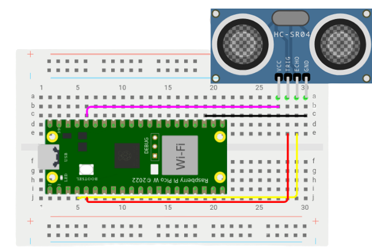

<p style="text-align: justify;">El HC-SR04 es un sensor de distancia de baja precisión basado en ultrasonidos. Con él permite medir distancias de una forma sencilla y rápida, aunque en principio no se suele usar para eso. Lo más frecuente es que se utilice como un transductor para detectar obstáculos y poderlos evitar mediante otros mecanismos asociados a la respuesta del sensor.</p>

<p align = "center">
  
</p>

# Principios
<p style="text-align: justify;">
En el HC-SR04, el emisor emitirá ultrasonidos y cuando reboten en un objeto u obstáculo que se encuentre en el camino serán captados por el receptor. El circuito se encargará de hacer los cálculos necesarios de ese eco para determinar la distancia.
</p>

# Pines
<p style="text-align: justify;">
La figura que figura a continuación muestra la configuración de pines de un sensor ultrasónico. Consta de cuatro pines a saber; Vcc, tierra, Trigger y eco.
</p>

<p align = "center">
  
</p>

* **Vcc** y **tierra** se utilizan para alimentar el sensor. Debemos suministrar 5 voltios al pin Vcc y conectar el pin GND con el terminal de tierra de la fuente de alimentación.

* **Trigger**: Es un pin de entrada. Se utiliza un pin de disparo para iniciar el sensor ultrasónico para iniciar la medición de distancia o el rango de distancia. Cuando los usuarios desean obtener mediciones de distancia del sensor, aplicamos un pulso de 10μs a este pin.

* **Eco**: Este es un pin de salida de pulso. El pin de eco produce un pulso como salida. El ancho del pulso o el tiempo de encendido del pulso depende de la distancia entre el sensor ultrasónico y el obstáculo que se coloca delante del sensor HC-SR04. En condiciones de inactividad, este pin permanece en un nivel bajo activo.

# Ejemplo de integración con Raspberry Pi Pico W

<p style="text-align: justify;">
Para calcular la distancia entre el sensor y el objeto, el sensor mide el tiempo que transcurre entre la emisión del sonido por parte del transmisor hasta su contacto con el receptor.
</p>

<p align = "center">
  
</p>

<p style="text-align: justify;">
El siguiente código sigue la misma lógica, la distancia es obtenida mediante el tiempo que le tomo al sensor detectar la onda de sonido enviada multiplicado por la velocidad del sonido.
</p>

``` python
from machine import Pin
import utime
trigger = Pin(3, Pin.OUT)
echo = Pin(2, Pin.IN)
def ultra():
   trigger.low()
   utime.sleep_us(2)
   trigger.high()
   utime.sleep_us(5)
   trigger.low()
   while echo.value() == 0:
       signaloff = utime.ticks_us()
   while echo.value() == 1:
       signalon = utime.ticks_us()
   timepassed = signalon - signaloff
   distance = (timepassed * 0.0343) / 2
   print("La distancia con el objeto es: ",distance,"cm")
while True:
   ultra()
   utime.sleep(1)
```
Prueba este ejemplo en Wokwi [Aqui](https://wokwi.com/projects/376234821388137473)
