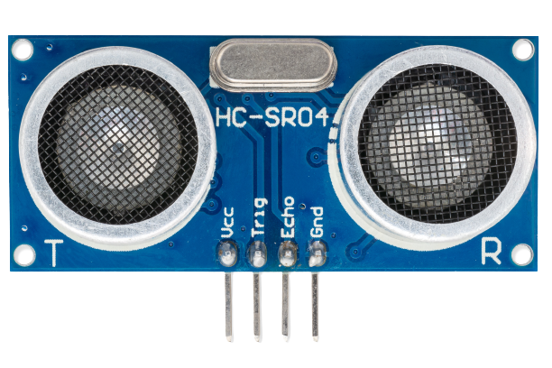
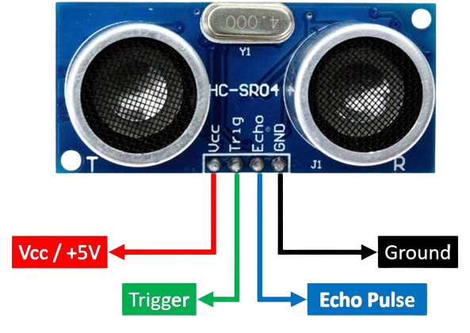

El HC-SR04 es un sensor de distancia de baja precisión basado en ultrasonidos. Con él permite medir distancias de una forma sencilla y rápida, aunque en principio no se suele usar para eso. Lo más frecuente es que se utilice como un transductor para detectar obstáculos y poderlos evitar mediante otros mecanismos asociados a la respuesta del sensor.

  

# Principios

En el HC-SR04, el emisor emitirá ultrasonidos y cuando reboten en un objeto u obstáculo que se encuentre en el camino serán captados por el receptor. El circuito se encargará de hacer los cálculos necesarios de ese eco para determinar la distancia.

# Pines

La figura que figura a continuación muestra la configuración de pines de un sensor ultrasónico. Consta de cuatro pines a saber; Vcc, tierra, Trigger y pulso de eco.

  

