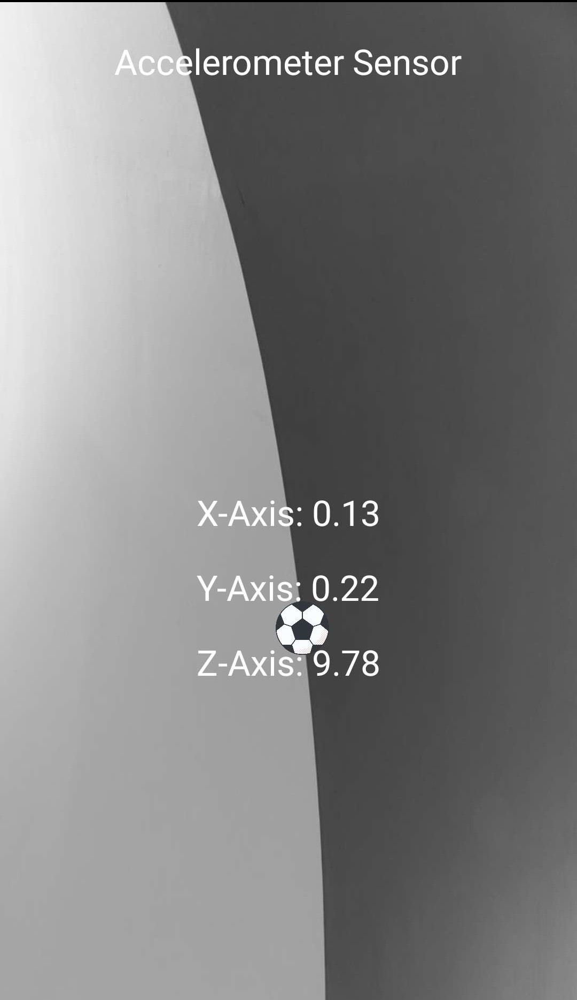
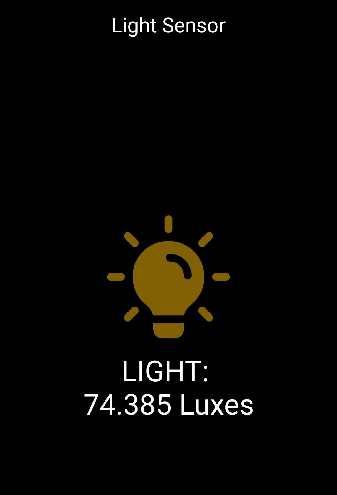
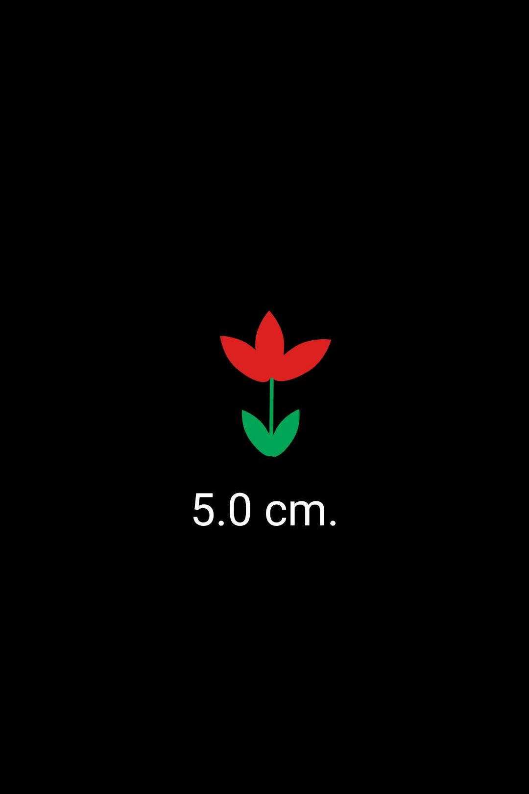
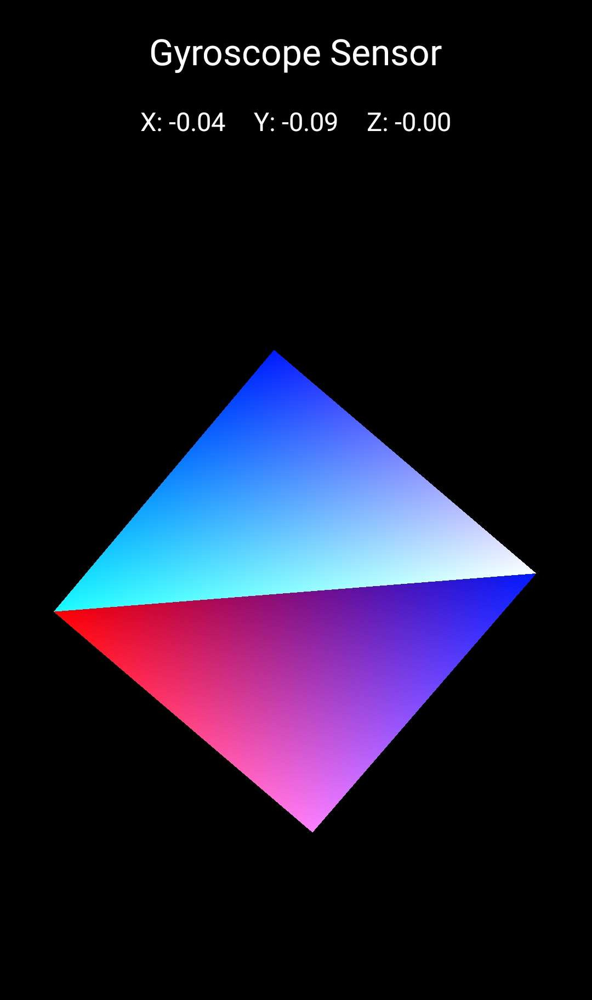
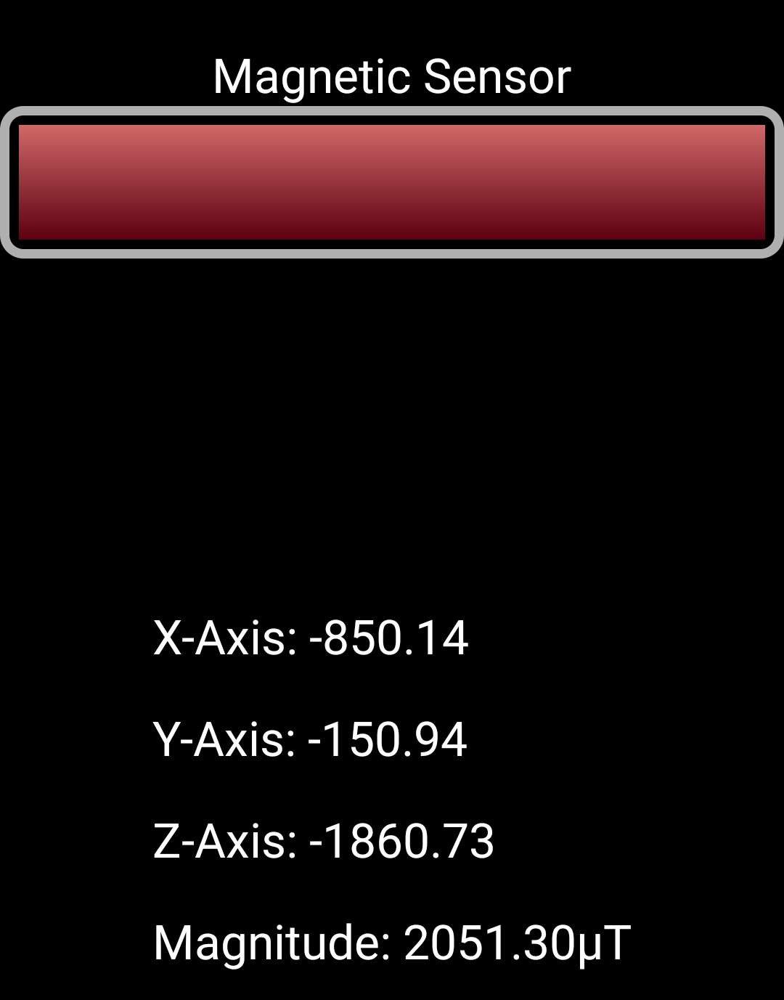

# Tabla de Sensores

|         Sensor        | Icono |                       Descripción                      | Disponibilidad |                   Captura de Pantalla                  |
|:---------------------:|:-----:|:------------------------------------------------------:|:--------------:|:------------------------------------------------------:|
|      Acelerómetro     |       | Detectar dirección del dispositivo.                    |       Sí       |      |
|     Sensor de luz     |       | Detecta la intensidad de la luz del entorno.           |       Sí       |         |
| Sensor de Orientación |       | Estado de la dirección del dispositivo.                |       Sí       |    |
|  Sensor de Proximidad |       | Distancia del dispositivo a la cara/manos.             |       Sí       |  |
| Sensor de Temperatura |       | Detección de temperatura.                              |       No       | No detectado                                           |
|       Giroscopio      |       | Mide 6 direcciones al mismo tiempo (Posición 3D).      |       Sí       |        |
|    Sensor de Sonido   |       | Intensidad de sonido alrededor del dispositivo.        |       No       | No detectado                                           |
|    Sensor Magnético   |       | Detección de campos magnéticos.                        |       Sí       |   |
|   Sensor de Presión   |       | Medición de la presión ambiental, detección de altura. |       No       | No detectado                                           |
